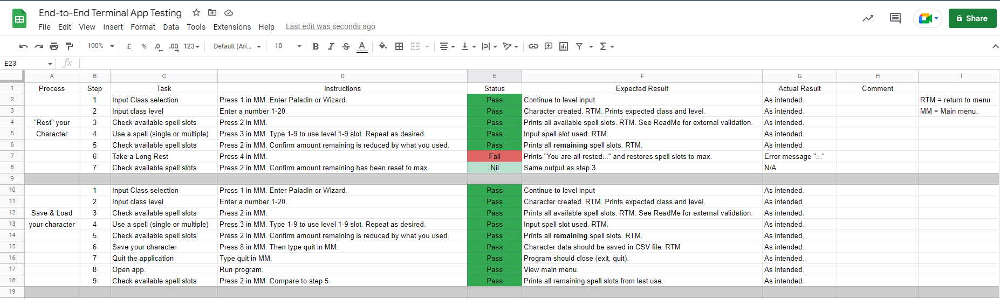
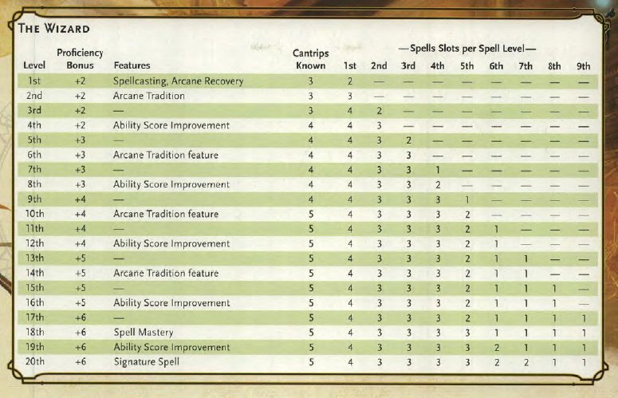
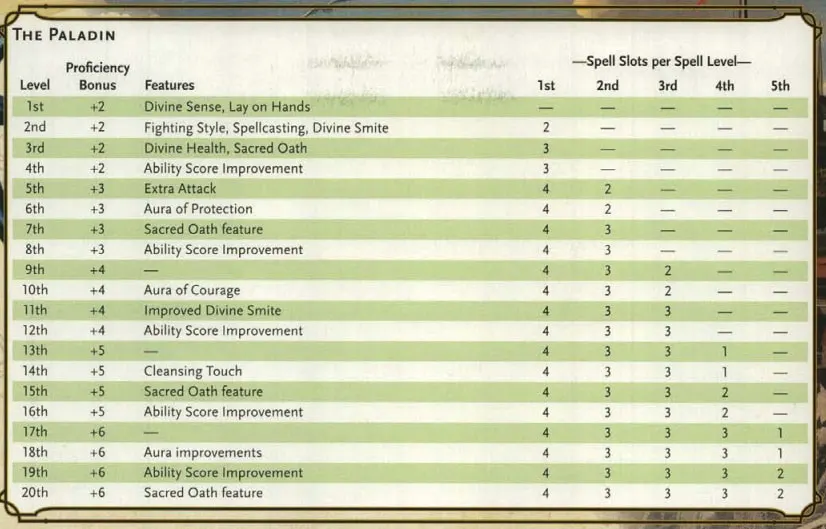

Installation guide:

1) If you don't have python or python3 installed, you need to install python3 before using this progam (or it'll tell you to install python.)
2) Open your terminal of choice.
3) Change directories into the src directory. e.g. cd where/you/saved/JakebCockburn_T1A3/src
4) copy, paste and enter: sudo chmod +x wrapper.sh
4.2) This will give permission to the wrapper to execute.
5) copy, paste and enter: ./wrapper.sh
5.2) This will install all other prerequisites and run the program for you. If you do not have python installed, again, it'll tell you to install python with a link. 


# Video link

https://vimeo.com/782028492/5e6882d34a

# GitHub Link

https://github.com/AppleVine/terminal_app

# Project management

https://trello.com/invite/b/rdstGF0P/ATTI232b1437e307958311951e670b0816ba1A6EFCFA/terminal-app-project


# Testing

https://docs.google.com/spreadsheets/d/1GNs_gPxMxnVC6SYm-1gjLvLIXTqMV4tJJm-SI07-lq4/edit?usp=sharing




# Validation of class data:

Wizard table:
http://pm1.narvii.com/6956/1ace3f873a9152e9ff03048a45b95e25f142cc82r1-775-499v2_uhq.jpg


Paladin Table:
https://mykindofmeeple.com/wp-content/uploads/2022/01/Paladin-spell-slots-table-5e-dnd.jpg.webp



# Error Handling

This supports the addition of a later variable spell_database which I will hopefully be able to create in a future update. If it was available and this error occurs, then view_spell_database does not have access to the variable (which could be just passing spell_database if it were created).

```python
def view_spell_database():
    try:
        print(spell_database)
    except NameError:
        input("Spell database has not been created yet.")
```

If the file were moved, deleted or corrupted then the user would recieve a FileNotFoundError when trying to load the character. Saving a new character should resolve this issue so allowing them to continue makes sense.

```python
try:
    your_character = load_character()
except FileNotFoundError:
    input("Save file is not found. Please create a character.\nPress Enter to continue.\n\n-------- \n\n")
main_menu(your_character)
```

This will occur if get_spells cannot access your_character. The returning of your_character is tricky between functions, so any messing around with the code could make an issue with this variable where it cannot access the information and return this error message, however it could also be a loading error if that was changed and by making a character in menu this would still continue to function. 

```python
def get_spells(your_character):
    try:
        print("You have " + str(your_character.level_1_remaining) + " level 1 spellslots available.")
        print("You have " + str(your_character.level_2_remaining) + " level 2 spellslots available.")
        print("You have " + str(your_character.level_3_remaining) + " level 3 spellslots available.")
        print("You have " + str(your_character.level_4_remaining) + " level 4 spellslots available.")
        print("You have " + str(your_character.level_5_remaining) + " level 5 spellslots available.")
        print("You have " + str(your_character.level_6_remaining) + " level 6 spellslots available.")
        print("You have " + str(your_character.level_7_remaining) + " level 7 spellslots available.")
        print("You have " + str(your_character.level_8_remaining) + " level 8 spellslots available.")
        print("You have " + str(your_character.level_9_remaining) + " level 9 spellslots available.")
        input("\nPress enter to return to the main menu.\n\n-------- \n\n")
    except AttributeError:
        input("You need to create a charcter first.\nPress enter to return to main menu.\n\n-------- \n\n")
```
This was made differently to get_wizard_level in order to show a ValueError by requiring integer of user input instead of a string. If the user tries to input a non-integer it'll create a ValueError, which can be resolved by the user inputting the correct value, hence looping them back in. 

```python
def get_paladin_level():
    input_level = 0
    your_character = None
    while your_character == None:
        try:
            system('clear')
            input_level = input("What level is your Paladin? Please choose from 1-20.\n")
            system('clear')
            int_input = int(input_level)
            if input_level == "quit":
                quit()
            elif int_input == 1:
                return Half_Caster("Paladin", 1)
            elif int_input == 2:
                return Half_Caster("Paladin", 2, 0, 2)
            elif int_input == 3:
                your_character = Half_Caster("Paladin", 3, 0, 3)
                return your_character
            elif int_input == 4:
                your_character = Half_Caster("Paladin", 4, 0, 3)
                return your_character
            elif int_input == 5:
                your_character = Half_Caster("Paladin", 5, 0, 4, 2)
                return your_character
            elif int_input == 6:
                your_character = Half_Caster("Paladin", 6, 0, 4, 2)
                return your_character
            elif int_input == 7:
                your_character = Half_Caster("Paladin", 7, 0, 4, 3)
                return your_character
            elif int_input == 8:
                your_character = Half_Caster("Paladin", 8, 0, 4, 3)
                return your_character
            elif int_input == 9:
                your_character = Half_Caster("Paladin", 9, 0, 4, 3, 2)
                return your_character
            elif int_input == 10:
                your_character = Half_Caster("Paladin", 10, 0, 4, 3, 2)
                return your_character
            elif int_input == 11:
                your_character = Half_Caster("Paladin", 11, 0, 4, 3, 3)
                return your_character
            elif int_input == 12:
                your_character = Half_Caster("Paladin", 12, 0, 4, 3, 3)
                return your_character
            elif int_input == 13:
                your_character = Half_Caster("Paladin", 13, 0, 4, 3, 3, 1)
                return your_character
            elif int_input == 14:
                your_character = Half_Caster("Paladin", 14, 0, 4, 3, 3, 1)
                return your_character
            elif int_input == 15:
                your_character = Half_Caster("Paladin", 15, 0, 4, 3, 3, 2)
                return your_character
            elif int_input == 16:
                your_character = Half_Caster("Paladin", 16, 0, 4, 3, 3, 2)
                return your_character
            elif int_input == 17:
                your_character = Half_Caster("Paladin", 17, 0, 4, 3, 3, 3, 1)
                return your_character
            elif int_input == 18:
                your_character = Half_Caster("Paladin", 18, 0, 4, 3, 3, 3, 1)
                return your_character
            elif int_input == 19:
                your_character = Half_Caster("Paladin", 19, 0, 4, 3, 3, 3, 2)
                return your_character
            elif int_input == 20:
                your_character = Half_Caster("Paladin", 20, 0, 4, 3, 3, 3, 2)
                return your_character
        except ValueError:
            input("That's not a valid response, please only enter a number from 1-20.\nPress Enter to continue.")
```